# Домашнє завдання 1: AWS EC2 і Application Load Balancer

## Мета

Налаштувати два EC2-інстанси, встановити на них вебсервер nginx, створити Target Group і Application Load Balancer, а після завершення роботи зупинити інстанси.

## Крок 1. Створіть обліковий запис AWS

Якщо облікового запису ще немає, зареєструйте безкоштовний обліковий запис AWS Free Tier.

## Крок 2. Запустіть EC2-інстанси

У консолі AWS відкрийте сервіс **EC2** і створіть два нових інстанси з параметрами:

- AMI: **Amazon Linux 2023**;
- тип інстансу: **t3.micro**;
- створіть нову пару ключів і збережіть приватний ключ;
- налаштуйте Security Group для доступу за SSH (порт 22) і HTTP (порт 80).

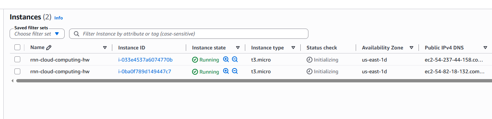

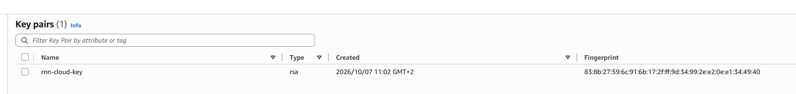

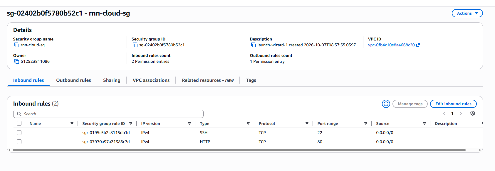

## Крок 3. Підключіться до інстансу за SSH

Після запуску інстанса підключіться до нього через вебконсоль AWS.

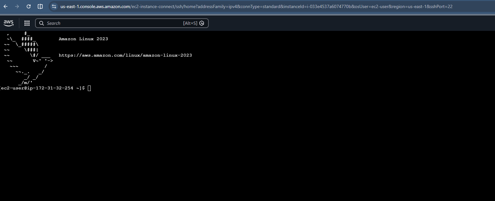

## Крок 4. Встановіть nginx

У терміналі інстансу виконайте команду:

```bash
sudo yum install nginx
sudo systemctl enable nginx
sudo systemctl start nginx
```

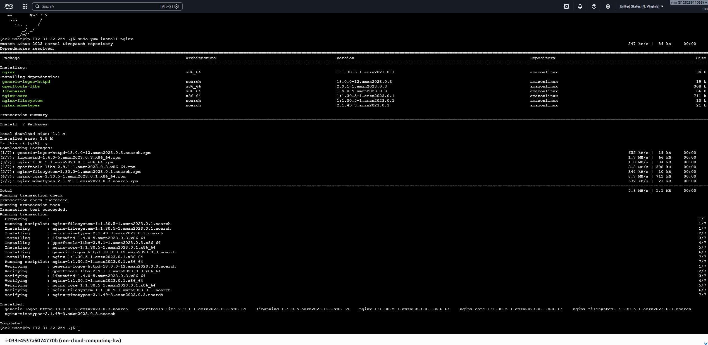

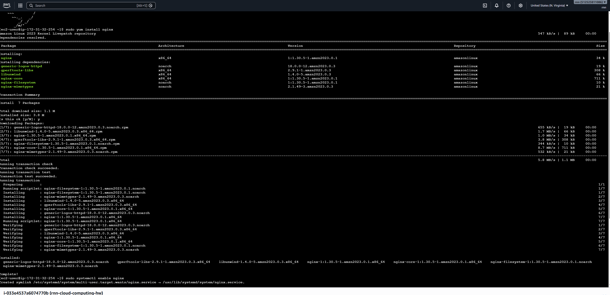

## Крок 5. Перевірте роботу сервера

Відкрийте у браузері публічний DNS вашого інстансу. Має з'явитися стандартна сторінка nginx.

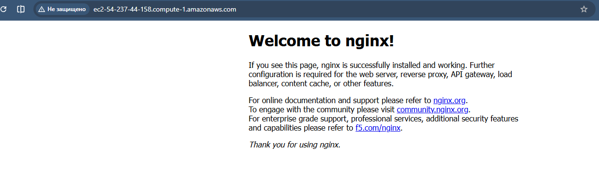

## Крок 6. Створіть Target Group

Налаштуйте Target Group для двох EC2-інстансів. Додайте інстанси до групи та перевірте їх статус.

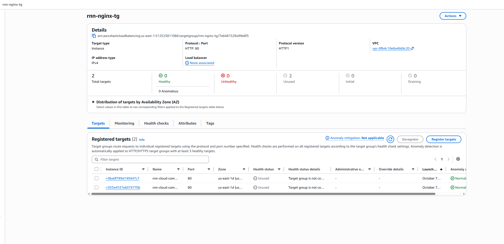

## Крок 7. Створіть Application Load Balancer

Створіть Application Load Balancer, підключіть його до Target Group і перевірте маршрутизацію трафіку.

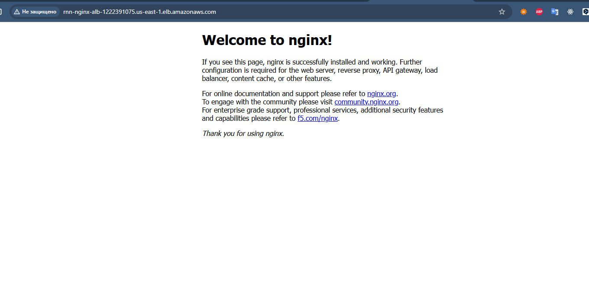

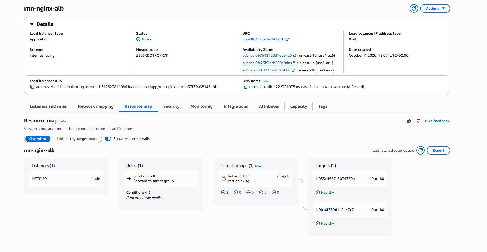

## Крок 8. Зупиніть інстанси

Після завершення перевірки зупиніть інстанси в консолі EC2, щоб не витрачати ресурси.

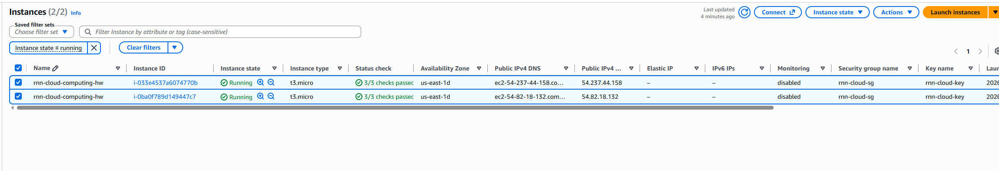

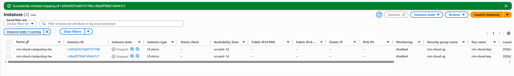

> Не забувайте видаляти непотрібні ресурси, зокрема Target Group і Load Balancer, якщо вони більше не потрібні.
